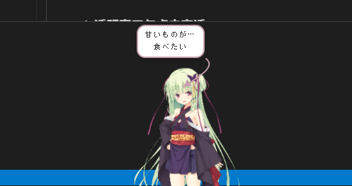
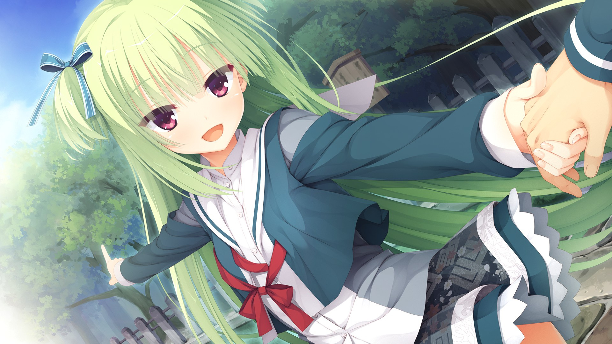

# 丛雨桌宠 (Murasame Pet)

基于 Electron 的透明桌面角色应用，使用分层 PNG 合成实现多状态动画。




---

## 目录结构

```
murasame-pet/
├── main.js            # 主进程：窗口、托盘、IPC、自启
├── renderer.js        # 渲染进程：状态机、交互逻辑、图层控制
├── index.html         # 窗口 HTML：图层容器、气泡、ZZZ 等 UI 元素
├── styles/
│   └── animations.css # 所有状态的 CSS 关键帧动画
├── assets/            # 应用图标（icon.ico / icon.png）
└── package.json       # 依赖、构建配置
```

图片资源（独立目录，不在项目内）：

```
../fgimages/           # 开发时位于项目上级目录
  ├── 体_通常.png      # 正常身体
  ├── 体_腕上げ.png    # 抬手身体
  ├── 顔_通常.png      # 默认表情
  ├── 顔_笑い.png      # 微笑
  └── ...              # 其他表情和效果层
```

---

## 部署流程

```bash
# 安装依赖
npm install

# 开发运行（需要 ../fgimages 目录存在）
npm start

# 打包 Windows 安装包
npm run build:win

# 打包 Linux AppImage
npm run build:linux
```


---

## 已知平台差异

| 功能 | Windows | macOS | Linux |
|------|---------|-------|-------|
| 点击穿透 | `setIgnoreMouseEvents` + forward | 同左 | 同左（效果存疑） |
| 自动开机启动 | 写注册表 `HKCU\...Run` | `loginItems` API | 写 `~/.config/autostart/*.desktop` |
| 托盘图标 | `.ico` 文件 | `.png` 文件 | `.png` 文件 |

---



*白马？哼，定叫他有来无回！*